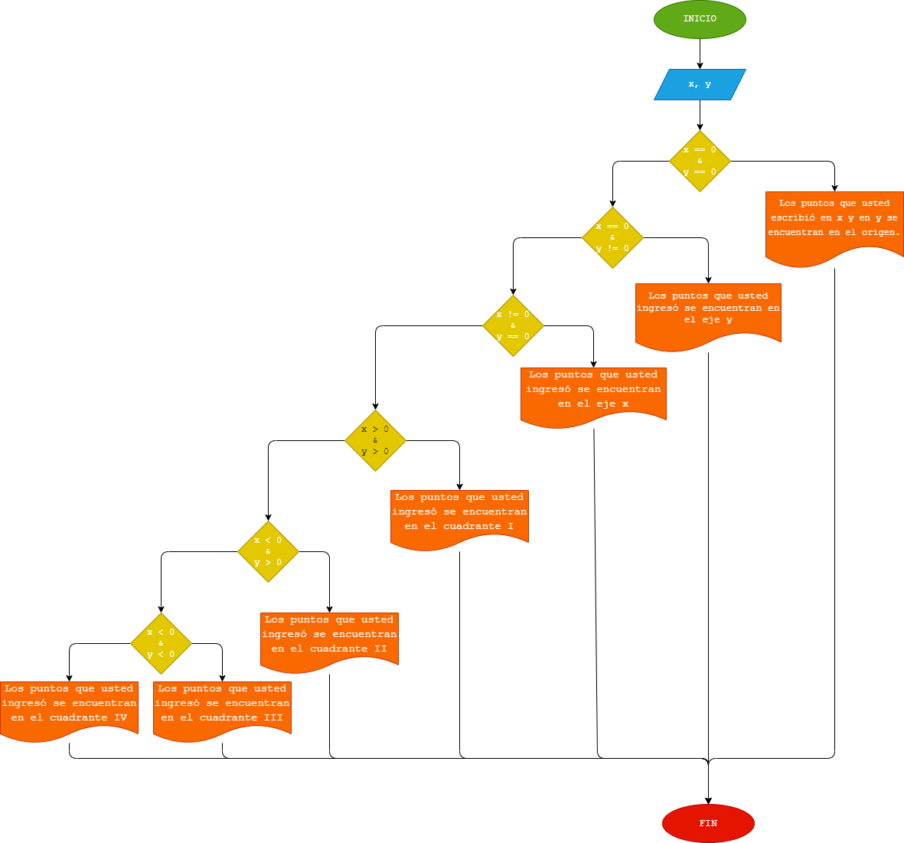

# ANÁLISIS
Programa que lea las coordenadas cartesianas (x, y) de un punto en el plano y calcule el cuadrante al cual pertenece el punto. Si el punto está en el origen o sobre un eje también debe indicarlo.
# DISEÑO
## DIAGRAMA DE FLUJO

