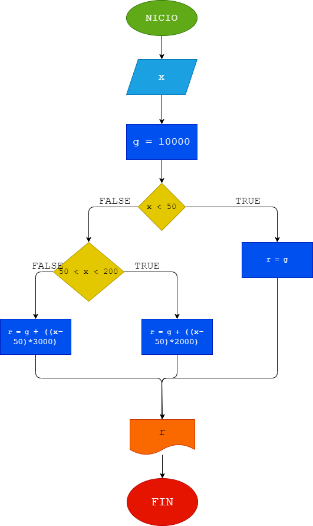

# EJERCICIO 5
## ANÁLISIS
Calcular el gasto de agua de una vivienda dado el número de m3 de agua gastados, siendo el sistema de cobro el siguiente:

-La cuota fija mensual es de $10000.

-Los primeros 50 m3 son gratis.

-Entre 50 y 200 m³ se cobra el m3 a $2000.

-A partir de 200 m³ se cobra el m3 a $3000.
## DISEÑO
### DIAGRAMA DE FLUJO
