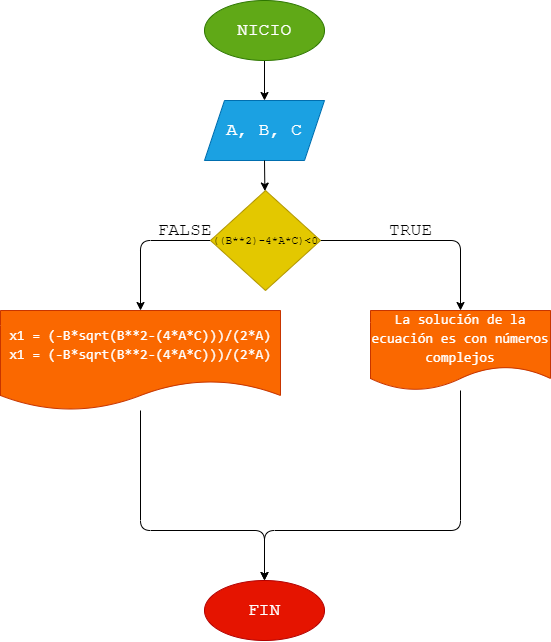

# EJERCICIO 6
## ANÁLISIS
Calcular e imprimir las raíces de la ecuación de segundo grado de coeficientes reales. El programa debe tener en cuenta los diferentes casos que puedan surgir: la existencia de dos raíces reales distintas, de dos raíces reales iguales y de dos raíces complejas.
## DISEÑO
### DIAGRAMA DE FLUJO
